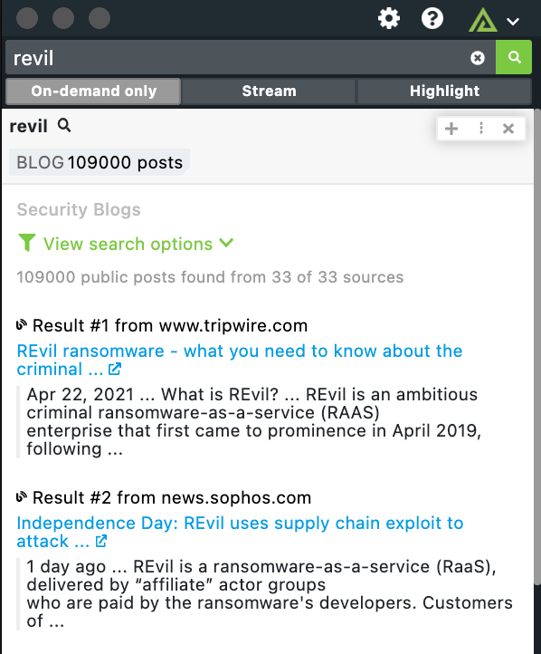

# Polarity Security Blogs Integration

The Polarity Security blogs integration uses the Google search API to search for infromation on info-sec blogs.

Below is a list of blogs that are searched:

- akami
- bleepingcomputer
- crowdstrike
- csoonline
- danielmiessler
- darkreading
- fireeye
- gbhackers
- grahamcluley
- horizon3
- infosecurity-magazine
- itsecurityguru
- krebsonsecurity
- lastwatchdog
- microsoft
- norfolkinfosec
- recordedfuture
- schneier
- scmagazine
- securityaffairs
- securityweekly
- silobreaker
- sophos
- talosintelligence
- taosecurity
- tenable
- thehackernews
- theregister
- threatpost
- trendmicro
- tripwire
- troyhunt
- paloaltonetworks
- zdnet

|  |
| ---------------------------- |
| _Security Blogs Example_     |

## Security Blog Integration Options

### API Key

Valid Google CSE API Key

## Installation Instructions

Generate a new CSE API key on the following page:

https://developers.google.com/custom-search/v1/overview

A free account allows for up to 100 search queries per day.

Once the API key has been generated, input the information into the API Key field in the integration and start searching for exploits.

## Polarity

Polarity is a memory-augmentation platform that improves and accelerates analyst decision making. For more information about the Polarity platform please see:

https://polarity.io/
